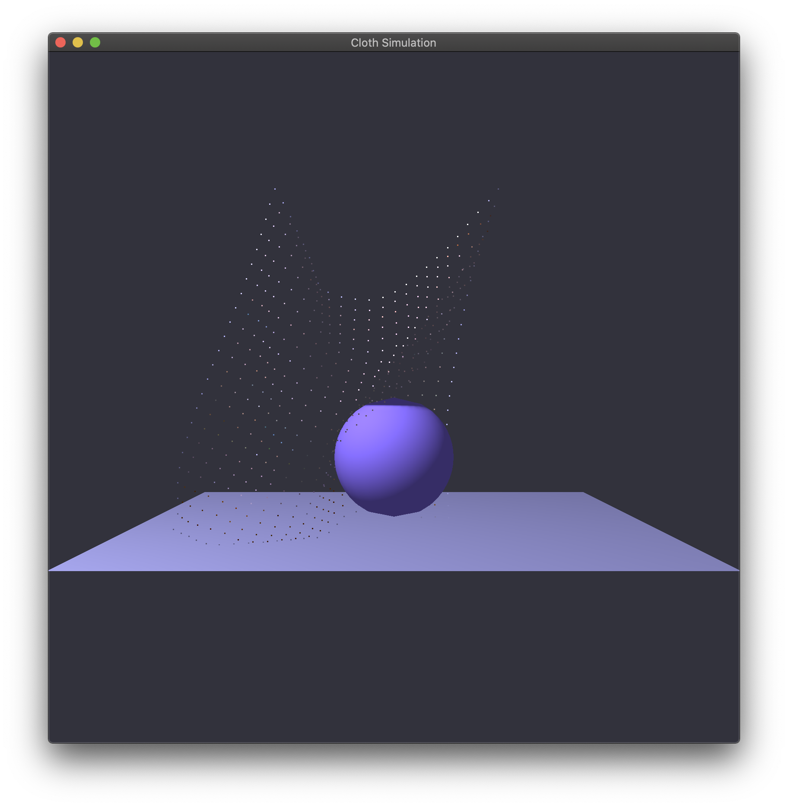
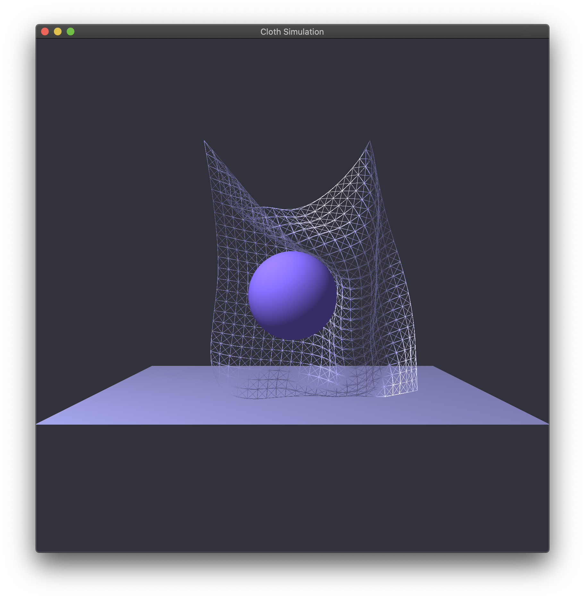
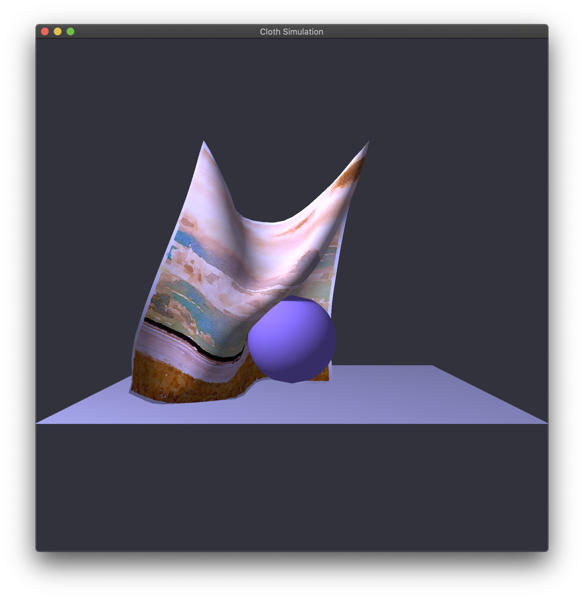

# Cloth Simulation

  

### UI
- ##### Window
  - `ESC` Exit
- ##### Draw Mode: Change the rendering mode of cloth
  - `Z` Node Mode
  - `X` Spring Mode
  - `C` Cloth Mode
- ##### Camera
  - `W` `S` `A` `D` Move camera up / down / left / right
  - `Q` `E` Move camera closer / farther
- ##### Pause
  - `T` Pause
  - `R` Resume
- ##### Wind Force
  - `MOUSE_BUTTON_LEFT` Click to apply wind force
  - `↑` `↓` `←` `→` Apply wind force
- ##### Pin Point
  - `O` Free left pin
  - `P` Free right pin
### Environment
- ##### Xcode 11.1
- ##### OpenGL 3.3
  - GLAD
  - glfw
  - glew
  - glTools
- ##### Other
  - glm
### Data Structures
- ##### Vectors.h
  - `struct Vec2`
  - `struct Vec3`
- ##### Points.h
  - `struct Vertex`
    - A simple type of points with only position and normal data
    - Used in rigid body (without texture or anything else)
  - `class Node`
    - Point with physical properties.
    - Used in cloth.
    - Execute collision detection actively.
- ##### Spring.h
  - `class Spring`
- ##### Cloth.h
  - `class Cloth`
- ##### Rigid.h -> Any rigid body without texture mapping
  - `struct Ground`
  - `class Sphere`
  - `struct Ball`
- ##### Program.h -> Shader program built itself from .glsl files
  - `class Program`
- ##### Display.h -> Global camera, light & Renderers for cloth and rigid bodies
  - `struct Camera`
  - `struct Light`
  - `struct ClothRender`
  - `struct SpringRender`
  - `struct ClothSpringRender`
  - `struct RigidRender`
  - `struct GroundRender`
  - `struct BallRender`
  
